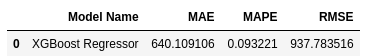

# Rossmann Sales Prediction

<

## Introduction

An end-to-end Data Science project with a regression adapted for time series as solution was created four machine learning models to forecast the sales. Predictions can be accessed by users through a bot from the smartphone app Telegram.

This repository contains the solution for a Kaggle competition problem: https://www.kaggle.com/c/rossmann-store-sales

This project is part of the "Data Science Community" (Comunidade DS), a study environment to promote, learn, discuss and execute Data Science projects. For more information, please visit (in portuguese): https://sejaumdatascientist.com/
The goal of this Readme is to show the context of the problem, the steps taken to solve it, the main insights and the overall performance.

**Project Development Method**

The project was developed based on the CRISP-DS (Cross-Industry Standard Process - Data Science, a.k.a. CRISP-DM) project management method, with the following steps:

- Business Understanding
- Data Collection
- Data Cleaning
- Exploratory Data Analysis (EDA)
- Data Preparation
- Machine Learning Modelling and fine-tuning
- Model and Business performance evaluation / Results

&nbsp; 
  

    
  

  &nbsp; 

#### This project was made by Marx Cerqueira.

---

## Table of Contents
- [Introduction](#introduction)
- [1. Business Problem](#1-business-problem)
- [2. Solution Strategy](#2-solution-strategy)
- [3. Top 3 Data Insights](#3-top-3-data-insights)
- [4. Machine Learning Model Applied](#4-machine-learning-model-applied)
- [5. Machine Learning Model Performance](#5-machine-learning-model-performance)
- [6. Business Results](#7-bussines-results)
- [7. Conclusion](#8-conclusion)
- [8. Lessons Learned](#9-lessons-learned)
- [9. Next Steps to Improve](#10-next-steps-to-improve)
- [10.References](#references)

---

# 1. Business Problem.

**The Rossmann Sales Company**

- A private drug store chain based in Germany, with main operations on Europe. Operates over 3,000 drug stores in 7 different contries.
- Offers heathcare and beauty product, including baby and body care, hygiene, cosmetics, dental hygiene, hair care, and so on.
- Business Model: Product sales.

**Problem**

- The CFO wanted to reinvest in all stores, therefore, he need to know how much revenue each store will bring so he can invest it now.

**Goal**

- Predict the daily sales of all stores for up to six weeks in advance.

**Deliverables**

- Model's performance and results report with the following topics:
    - What's the daily sales in dollars for the next 6 weeks?
    - Predictions will be available through a Telegram Bot where stakeholders can acess the prediction by a smartphone
   
[back to top](#table-of-contents)

# 2. Solution Strategy

The strategy adopted was the following:

**Step 01. Data Description:**  I searched for NAs, checked data types (and adapted some of them for analysis) and presented a statistical description.

**Step 02. Feature Engineering:** New features were created to make possible a more thorough analysis.

**Step 03. Data Filtering:**  Entries containing no information or containing information which does not match the scope of the project were filtered out.

**Step 04. Exploratory Data Analysis:**  I performed univariate, bivariate and multivariate data analysis, obtaining statistical properties of each of them, correlations and testing hypothesis (the most important of them are detailed in the following section).

**Step 05. Data Preparation:** This step is necessary both for feature selection and for the machine learning models. Regarding the data types, numerical data was rescaled and categorical data was encoded.

**Step 06. Feature Selection:** The statistically most relevant features were selected using the Boruta package. 
In the next steps, the machine learning models trained by using the features selected by Boruta presented a better generalizability performance.

**Step 07. Machine Learning Modelling:** Some machine learning models were trained. The one that presented best results after cross-validation went through a further stage of hyperparameter fine tunning to optimize the model's generalizability.

**Step 08. Hyperparameter Fine Tunning:**

**Step 09. Convert Model Performance to Business Values:**

**Step 10. Deploy Model to Production:** The model is deployed on a cloud environment to make possible that other stakeholders and services access its results.

# 3. Top 3 Data Insights

The Mind Map shows the main factors that can contribute to a client to get into churn.
Both the mind map and the available data from the dataset will be the basis to create a hypothesis list.
The hypothesis list serves as the guide for the Exploratory Data Analysis (EDA), which aims to better understand the general data and features properties, as well as to generate business insights.

**Hypothesis 01:**

**True/False.**

**Hypothesis 02:**

**True/False.**

**Hypothesis 03:**

**True/False.**

# 4. Machine Learning Model Applied

The following machine learning models were trained:
* Mean of the target variable (baseline) Model;
* Linear Regression Model;
* Linear Regression Regularized Model - Lasso
* Random Forest Regressor;
* XGBoost Regressor.

All of them were cross-validated

# 5. Machine Learning Model Performance

The **Random Forest Regressor** and the **XGBoost Regressor** were the best model performers at both cycles, with a Mean Average Percentage Error (MAPE) of 7% and 9%, respectively. Since the XGBoost Regressor is known to train data fastly than random forest algorithms (and the model performance is not too different), **we used the XGBoost regressor as the main machine learning model for the project**.

 ## editar

The trained (cross-validated and fine tuned) model was also applied on a dataset of potential customers who did not participate in the initial poll.

Using the optimal set of parameters, we obtained the following results with the XGBoost model:

which had **a MAPE improvement of ~4.2%.**

# 6. Business Results

Considering all Rossmann stores, we would have **a total predicted sales for the next six weeks of \$284,153,920**, being \$283,772,779 for the worst scenario sales prediction, and \$284,535,044 for the best scenario. Scenarios were created to reflect MAPE variations. 

- The XGBoost model performed quite well across Rossmann stores except for three stores with MAPE above 14%:

Usually, the business has the final word on how permissible these error percentages can be. However, the model performs fairly well for most of the stores with a MAPE of ~5%. Since we have created a business case for this project, we will fictionally consider that the business has approved the model predictions.

The line plot below shows that predictions (in orange) were fairly on par with the observed sales values (in blue) across the last six weeks of sales represented by the validation data. 

The following graph shows the error rate (the ratio between prediction values and observed values) across six weeks of sales. **The model performs fairly well since it doesn't achieve higher error rates.** The 3rd and 5th weeks were the ones that the model performed not so well compared to other weeks:

One of the premises for a good machine learning model is to have a normal-shaped distribution of residuals with mean zero. In the following graph, we can observe that the **errors are centered around zero, and its distribution resembles a normal, bell-shaped curve.**

The following graph is a scatterplot with predictions plotted against the error for each sales day. Ideally, we would have all data points concentrated within a "tube" since it represents low error variance across all values that sales prediction can assume:

The machine learning model that predicts sales for Rossmann stores was deployed, and put it into production in the cloud with Heroku. By the end, Rossmann stakeholders will be able to access predictions with a Telegram Bot on their smartphones.

  The production architecture for this project is as follows:
  &nbsp; 
      
  &nbsp; 

  The architecture works like this: (1) a user texts the store number it wishes to receive sales prediction to a Telegram Bot; (2) the Rossmann API (rossmann-bot.py) receives the request and retrieve all the data related to that store number from the test dataset; (3) the Rossmann API sends the data to Handler API (handler.py); (4) the Handler API calls the data preparation (Rossmann.py) to shape the raw data and generate predictions using the trained XGBoost model; (5) the API returns the prediction to Rossmann API; (6) the API returns the total sales prediction for a specific store + a graph of sales prediction across the next six weeks to the user on Telegram:
  
  editar
  
 To access the application, you can add the Telegram Bot @RossmannBot and request predictions.
  

# 7. Conclusions

In this project, all necessary steps to deploy a complete Data Science project to production were taken. Using one CRISP-DM project management methodology cycle, a satisfactory model performance was obtained by using the XGBoost algorithm to predict sales revenue for Rossmann stores up to 6 weeks in advance, and useful business information was generated during the exploratory data analysis section. Due to this, the project met the criteria of finding a suitable solution for the company's stakeholders to access sales predictions on a smartphone application.

# 8. Lessons Learned

* The exploratory data analysis provides important insights to the business problem, many of which contradict the initial hypothesis. This information is valuable for the understanding of business and for planning future actions. This step also provides a preview of the result of the feature selection step.
* This predict problem was solved by using a Regression adaptaded to Time-Series method
* The choice of machine learning model used must consider the generalizability of the model, but also the cost of its deployment.

# 9. Next Steps to Improve

# 10. References 
1. stores.csv from Kaggle (https://www.kaggle.com/c/rossmann-store-sales/data?select=store.csv)
2. train.csv from Kaggle (https://www.kaggle.com/c/rossmann-store-sales/data?select=train.csv)
3. test.csv from Kaggle (https://www.kaggle.com/c/rossmann-store-sales/data?select=test.csv)

# LICENSE
MIT LICENSE
# All Rights Reserved - Comunidade DS 2021
